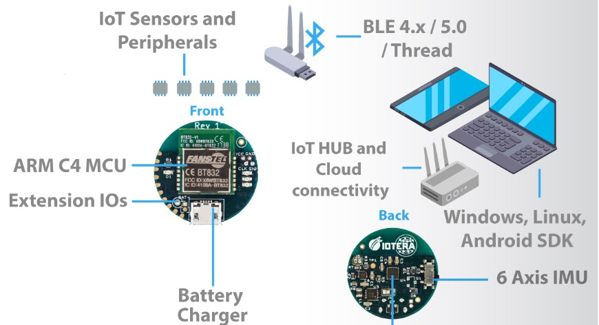
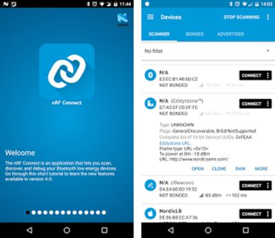
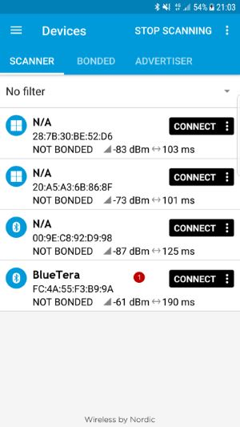
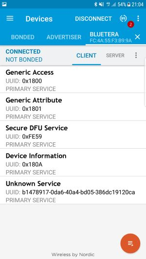
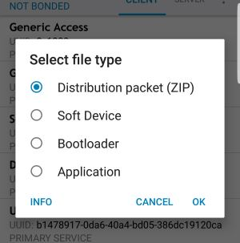
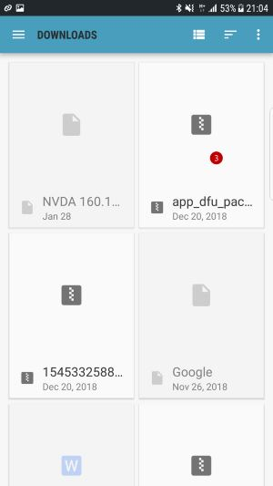
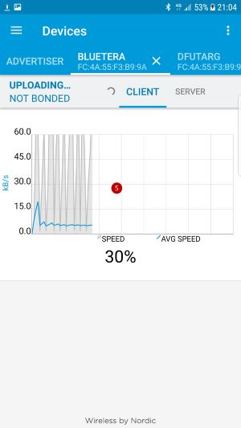

# About
Product based repository that includes information, links and files to get you started 
# Bluetera Platform  
Bluetera is an open source IoT platform for the development of smart and connected products. Bluetera platform is comprised of three main elements that are the building blocks of most IoT systems:
* Tiny hardware-based sensor hub to collect and analyze data; 
* wireless communication to link between the digital and physical side;
* SDK for major operating systems to build the software.

This walkthrough provides a high-level guide for using the Bluetera platform. The repositories, referenced below, provide the necessary code, documentation and examples to develop your own projects.

This walkthrough provides a high level guide for using the bluetera platform. dedicated repositories, refferenced below, provide the necessary documentation to develope your own projects.

# Table of Contents
1. [References](#references) to Bluetera platform repositories.
2. [System](#system) overview.
   1. [Hardware](#hw)
   2. [Firmware](#fw)
   3. [Software](#sw)
3. System [Guides](#guides).
   1. Firmware [update / debug](#fw_dbg)
   2. Firmware Over-the-air [update](#fw_oau)
   3. Windows [demo](#win_demo)
4. [Contributing](#cont).
5. [License](#license).

# References [^](#up)
Firmware [repository](https://github.com/ioteratech/bluetera-firmware).  
Windows SDK [repository](https://github.com/ioteratech/bluetera-windows-sdk).  
Android SDK repository (Comming Soon). 

# System Overview [^](#up) 
The Blutera platform includes the following major components 
* Bluetera module 
* Bluetera FW
* Blutera SDK 
* BLE CSR 4.0 dongle (for widows and Linux)
  
 
 
 
 ## Hardware  module [^](#up)
 The Bluetera hardware module is a tiny sensor hub based on an Arm microcontroller, Inertial Motion Unit, Power Management Unit and a peripheral Extension Unit.

 The module includes the following features. 
   * Tiny Module (26mm diameter)
   * Nordic nrf52832/40 based module with ARM M4F Processor. 
   * Invensense ICM-20648/9 6-axis IMU (gyro and accelerometer)  
   * Wireless communication : BLE 4.0/5.0/Thread
   * Power management unit with battery chargering capabilities 
   * Litium-Ion 50mAh rechargable battery 
   * Pheripheral extensions via digital, Analog, I2C, SPI, UART, PWM etc support 
   * Schematics for 3D printed casings
  

## Firmware [^](#up)
The Bluetera firmware is an open source project with code and libraries that can be used as a staging point for complicated products. Further research and development is done  using the standard Nordic IDE.
  
The firmware includes the following features.
* Events scheduler
* BLE stack and APIs
* IMU support - 50hz quaternion and acceleration data, 
* Dedicated IMU service.
* Protobuf for command and control functionality (TBR)
* SPI & I2C (TBR)
* SD card at 1khz support (TBR)
* Online and Offline modes of operation (TBR)
* Gyro & Acceleration at 1khz (TBR)
* Triggered and Programable Sliding windows with for buffering data at up-to 1 KHz (TBR)
  

## Software [^](#up)
The Bluetera software is an open source project with code and libraries. It supports the most popular operating systems and come with examoles of usage.
  
The software includes the following features:
   
* SDK for Windows, Linux and Android
* SDK for MAC and ioS (TBR)
* Prioprietory BLE stack for Windows (7/8/10) and Linux  
* IMU Control
* Multi devices control
* Online and offline modes of operation (TBR
* Protobuf support (TBR)
* Open source Logger App for windows
* Open source demo Apps  
* IMU Calibration functions (TBR)

# System guides [^](#up)

## Firmware Update / Firmware Debug (Wired) [^](#up)
See "Programming / Debugging the Device" section at FW [repository](https://github.com/ioteratech/bluetera-firmware).  
      

## Firmware Update (Over The Air) [^](#up)
1. Prerequisite : Initial FW with a Boot loader.   
2. Get Nordic NRF Connect App from the Android / IoS App store 

3. Get the latest FW update (app_dfu_package.zip) and store on your mobile 
4. Turn Bluetera device on – observe that the BLUE Led is blinking slowly (1-sec rate)
5. Scan for Bluetooth devices and find BLUETERA (1) 

6. Connect to device – Observe that the BLUE Led is blinking faster BLUETERA 
7. Click on the DFU button (Adjutant to the DICONNECT Menu item in NRF App) (2) 

8. Select a new Distribution packet (ZIP) (3) 

 

9. Bootloader should begin – Click on the BLUETERA device to observe progress

10. Wait till update process completes 

# Initial Usage (Windows Iotera Logger Demo) [^](#up)
Iotera logger demo is a Windows open source app that illustraits the usage of the IMU module and data logging. The source code and app can be found in the following [repository](https://github.com/ioteratech/bluetera-windows-sdk)

 
# Contributing [^](#up)
1. Boaz Aizenshtark - [Iotera Technologies](https://ioteratech.com/) 
2. Tomer Abramovich - [Iotera Technologies](https://ioteratech.com/) 
3. Avi Rabinovich - [Iotera Technologies](https://ioteratech.com/) 

 
# License [^](#up)
1. This project is licensed under the MIT License - see the [LICENSE](https://choosealicense.com/licenses/mit/) file for details.
